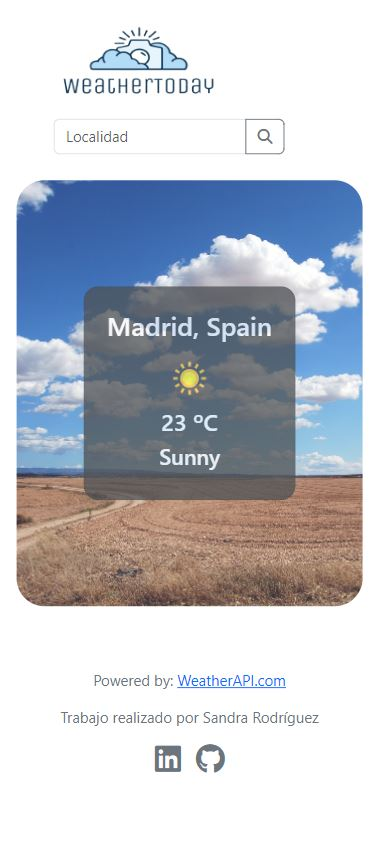

# ⛅ WeatherToday - Aplicación de Pronóstico del Tiempo

WeatherToday es una aplicación que te permite obtener información meteorológica actualizada para una localidad específica. Con esta aplicación, podrás consultar el pronóstico del tiempo del día actual en cualquier lugar del mundo.

## 💡 Características principales

- Búsqueda de localidades: Ingresa el nombre de la localidad deseada y obtén información precisa sobre el clima actual.

- Información detallada: WeatherToday proporciona datos como la temperatura, el estado del tiempo y el ícono del clima.

- Interfaz de usuario intuitiva: te permite obtener rápidamente la información que necesitas.

## 📷 Capturas de pantalla

## 💻 Tecnologías utilizadas

- Frontend: HTML5, CSS, JavaScript, React y Bootstrap
- Backend: con la API de WeatherAPI.com obtenemos datos meteorológicos precisos y en tiempo real.

## ✨ Autores

- [Sandra Rodríguez](https://github.com/srdgz)
